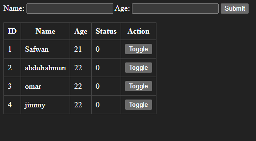

# User-Status-Toggle
This is a simple web application to manage student records using PHP and MySQL.
# ai_student Web Project

A simple web application to manage student records using PHP and MySQL.

---

## Features

- Add new students with name and age
- Store submitted data in a MySQL database table
- Display all student records in a styled table
- Toggle button for each record to switch the status value between 0 and 1
- Updated status is reflected immediately after toggling

---

## Technologies Used

- PHP
- MySQL
- HTML & CSS

---

## Screenshots

Here is a sample screenshot of the running project:



---

## Setup Instructions

### 1. Database Setup

- Open [phpMyAdmin](http://localhost/phpmyadmin)
- Create a database, for example: `testdb`
- Run this SQL code to create the table:

    ```sql
    CREATE TABLE ai_student (
        id INT NOT NULL AUTO_INCREMENT PRIMARY KEY,
        name VARCHAR(40) NOT NULL,
        age INT NOT NULL,
        status TINYINT(1) NOT NULL DEFAULT 0
    );
    ```

### 2. Project Files

- Place the project folder (for example, `ai_student`) inside the `htdocs` directory of your XAMPP or WAMP installation.
- Add the following files inside it:
    - `db.php` (Database connection file)
    - `index.php` (Main webpage)
    - `ai_student_project.png` (The screenshot above)

### 3. Database Connection

- Edit `db.php` to match your local MySQL username, password, and database name if different.

### 4. How T
